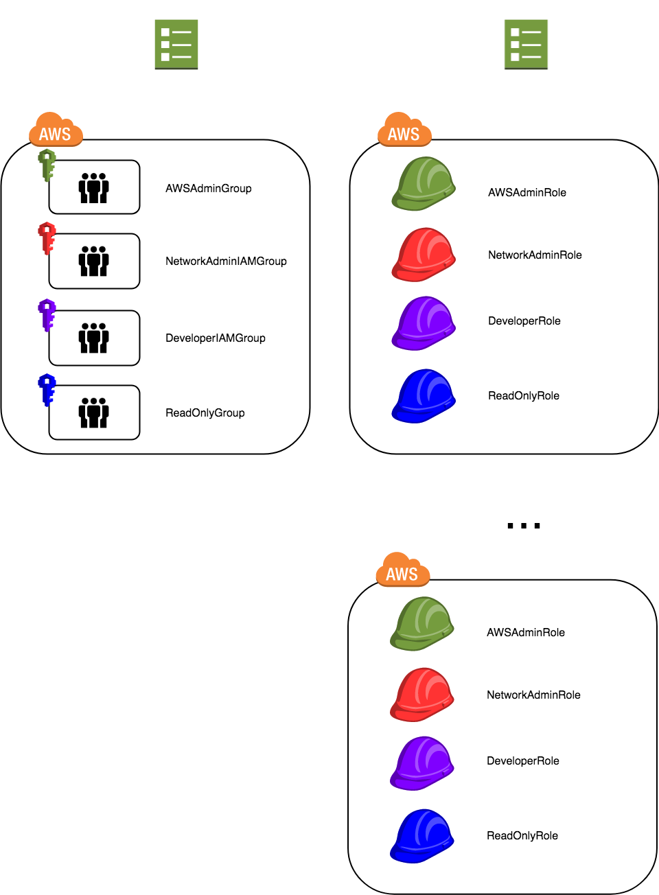

# getting-started-cross-account-roles

These example CloudFormation templates are to help you get started with secure cross-account roles. The job-functions/groups below are not exhaustive and this template can be updated to include as many additional groups and roles as is appropriate for your use case (i.e. data scientists, database admins, CI/CD systems).



## ***example-aws-federation-account-iam-groups.yaml***

This template creates 3 IAM User Groups: ***DeveloperGroup***, ***NetworkAdminGroup***, and ***AWSAdminGroup***. Each group has policies that only allow for IAM self management (change password, enable MFA token, etc.) and role assumption into the corresponding IAM Roles in the second CloudFormation Template. No other IAM Permissions are granted at this level and any privilege escalation will be done via role-assumption. Users can escalate their privilege by using the following link: https://signin.aws.amazon.com/switchrole?roleName=<IAM ROLE NAME TO BE ASSUMED>&account=<AWS ACCOUNT # or ALIAS>


This template should be deployed into your identity or federation account (i.e. wherein your IAM Users are created).  

## ***example-aws-federation-account-iam-roles.yaml***

This template creates 4 cross-account IAM Roles: ***ReadOnlyRole***, ***DeveloperRole***, ***NetworkAdminRole***, and ***AWSAdminRole***. Each IAM Role has policies that only allow for varying levels of IAM Permissions depending on job function. The roles titles are fairly self explanatory.

* ***ReadOnlyRole***: Any user in the above groups can assume this IAM Role which will grant *Read Only* access into the current child or federated account.

* ***AWSAdminRole***: Users assigned to the AWSAdminsGroup from above will have the ability to assume this IAM Role. This IAM Role grants full administrative access into whichever account it's deployed.

* ***NetworkAdminRole***: Users assigned to the NetworkAdminGroup from above will have the ability to assume this IAM Role. This IAM Role grants access to VPC, Subnets, NACLs, Security Groups, and Route Tables into whichever account it's deployed.

* ***DeveloperRole***: Users assigned to the DeveloperGroup from above will have the ability to assume this IAM Role. This IAM Role has two-tiers of access as determined by the *Environment* flag (condition) in the CloudFormation Parameters. In *Production* environments, the DeveloperRole will only have Read Only access. In **Development** or **Test** (sandbox) environments, the DeveloperRole has significantly more access. For example, RDS:\*, Lambda:\*, ELB:\*, etc etc. Please see the template for more details.

	Additionally, while the DeveloperRole will have access to deploy EC2 instances, they are limited to creating only smaller ec2 instances in a single given region (from a CloudFormation Parameter). This is to help limit costs and improve visibility.

This template must be deploy into EACH account that needs to be accessed via these cross-account roles, including the Identity Account (Roles can also be used within an account, not just cross-account. Yes I know it's confusing). Furthermore, any of the IAM Users in the above groups MUST have MFA enabled in order to assume any roles.

For additional security, the assume role policies can be restricted to only assume roles in certain accounts. See below as an example:

```
...
Version: '2012-10-17'
Statement:
-  	Effect: Allow
	Action: ["sts:AssumeRole"]
	Resource: !Join [ "", [ 'arn:aws:iam::', '*', ':role/DeveloperRole'] ]

...
```

vs
```
...

Version: '2012-10-17'
Statement:
-	Effect: Allow
	Action: ["sts:AssumeRole"]
	Resource: [ 'arn:aws:iam::111111111111:role/DeveloperRole',
		    'arn:aws:iam::222222222222:role/DeveloperRole',
		    'arn:aws:iam::333333333333:role/DeveloperRole']
...
```
