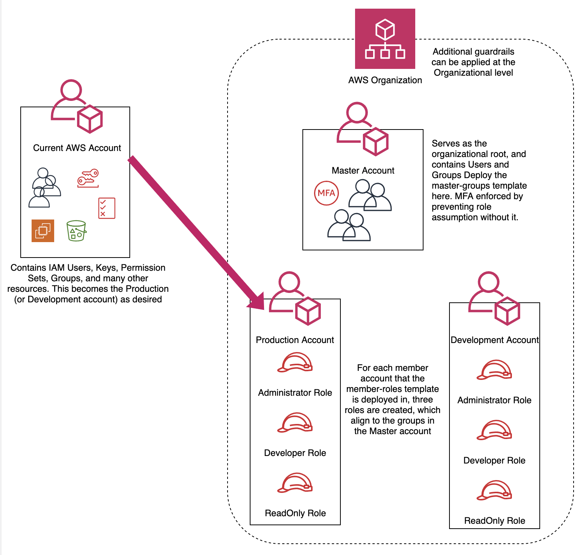

# getting-started-cross-account-roles

These example CloudFormation templates are to help you get started with secure cross-account roles. The job-functions/groups below are not exhaustive and this template can be updated to include as many additional groups and roles as is appropriate for your use case (i.e. data scientists, database admins, CI/CD systems).

# Prerequisites

As prerequisites to configuring and deploying this template, there must be at least two (we recommend 3) AWS accounts in an Organization. A pattern we see many customers follow is using their existing single account for Production, and then creating two more accounts to serve as the Organizational Root/ Master and the Development account. This process is also simplified by [adding aliases](https://docs.aws.amazon.com/IAM/latest/UserGuide/console_account-alias.html#Creating%20and%20Deleting%20Aliases%) to all accounts. 
This scenario would entail the following steps:

	1. Create one new AWS account to serve as Master. We recommend using an email that is not tied to one particular person for the Root User
	2. In the Master Account, create an AWS Organization
	3. Invite the Production (existing) to join the Organization
	4. Access the Production as an administrator, and accept the Organization Invitation
	5. Create an alias for the Production account
	6. Create [OrganizationAccountAccessRole](https://docs.aws.amazon.com/organizations/latest/userguide/orgs_manage_accounts_access.html#orgs_manage_accounts_create-cross-account-role) in Production account
	7. Return to the newly created Master account and create a Member account in the Organization to serve as the Development account
	8. Verify email and create an alias for the new Development account
	9.  Proceed through the rest of this guide to establish cross-account role assumption

See below for a Diagram of the 3-account setup:



## ***example-aws-federation-account-iam-groups.yaml***

This template creates 3 IAM User Groups: ***AWSAdminGroup***, ***DeveloperGroup***, and ***ReadOnlyGroup***. Each group has policies that only allow for IAM self management (change password, enable MFA token, etc.) and role assumption into the corresponding IAM Roles in a member account where the member roles have been instantiated. No other IAM Permissions are granted at this level and any privilege escalation will be done via role-assumption. Users can escalate their privilege by using the following link: https://signin.aws.amazon.com/switchrole?roleName=<IAM ROLE NAME TO BE ASSUMED>&account=<AWS ACCOUNT # or ALIAS>

This template should be deployed into your Master account (wherein your IAM Users are created).  

## ***example-aws-federation-account-iam-roles.yaml***

This template creates 3 cross-account IAM Roles: ***AWSAdminRole***, ***DeveloperRole***, and ***ReadOnlyRole***. Each IAM Role has policies that only allow for varying levels of IAM Permissions depending on job function. The roles titles are fairly self explanatory.

* ***AWSAdminRole***: Users assigned to the AWSAdminsGroup from above will have the ability to assume this IAM Role. This IAM Role grants full administrative access into whichever account it's deployed.

* ***DeveloperRole***: Users assigned to the DeveloperGroup from above will have the ability to assume this IAM Role. This IAM Role has two-tiers of access as determined by the *Environment* flag (condition) in the CloudFormation Parameters. In *Production* environments, the DeveloperRole will only have Read Only access for all AWS services except Service Catalog. In **Development** or **Test** (sandbox) environments, the DeveloperRole has significantly more access. For example, RDS:\*, Lambda:\*, ELB:\*, etc etc. Please see the template for more details.

* ***ReadOnlyRole***: Any user in the above groups can assume this IAM Role which will grant *Read Only* access into the current child or federated account.

This template must be deploy into EACH account that needs to be accessed via these cross-account roles, including the Master Account (roles can also be used within an account, not just cross-account). Furthermore, any of the IAM Users in the above groups MUST have MFA enabled in order to assume any roles.

## Customization Example

For additional security, the assume role policies can be restricted to only assume roles in certain accounts. See below as an example:

```
...
Version: '2012-10-17'
Statement:
-  	Effect: Allow
	Action: ["sts:AssumeRole"]
	Resource: !Join [ "", [ 'arn:aws:iam::', '*', ':role/DeveloperRole'] ]

...
```

vs
```
...

Version: '2012-10-17'
Statement:
-	Effect: Allow
	Action: ["sts:AssumeRole"]
	Resource: [ 'arn:aws:iam::111111111111:role/DeveloperRole',
		    'arn:aws:iam::222222222222:role/DeveloperRole',
		    'arn:aws:iam::333333333333:role/DeveloperRole']
...
```

# Using your newly created role-assumption

1. Create IAM users in the new Master account
2. Log in with your IAM user into Master account
3. Enable MFA for your user
4. Log out and log back in to Master, using MFA
5. Assume role into prod account using its alias and the role name using the following link: https://signin.aws.amazon.com/switchrole?roleName=<IAM ROLE NAME TO BE ASSUMED>&account=<AWS ACCOUNT # or ALIAS>